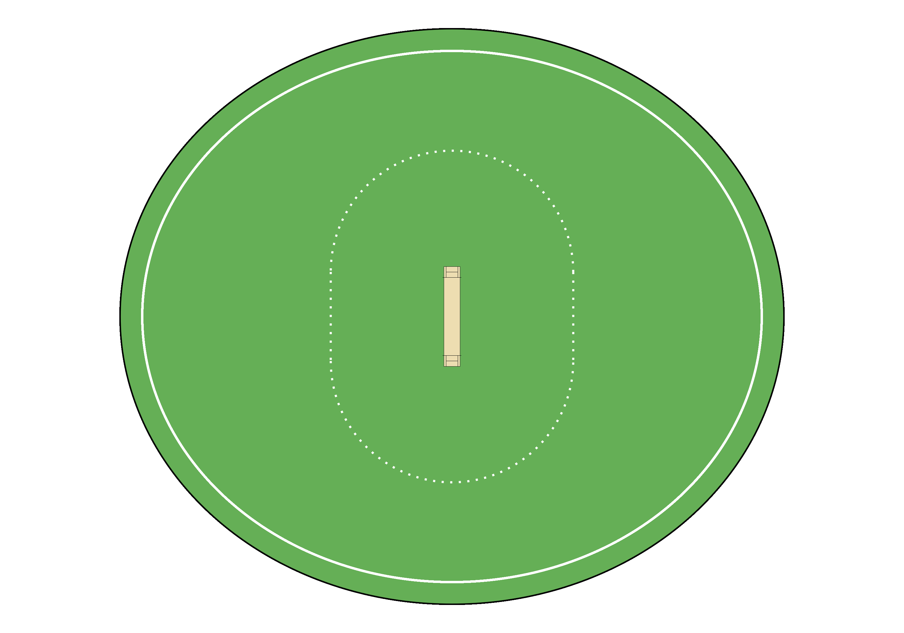
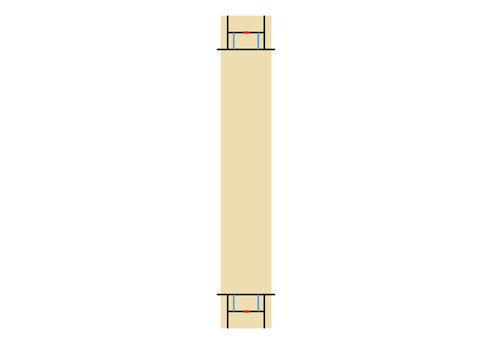
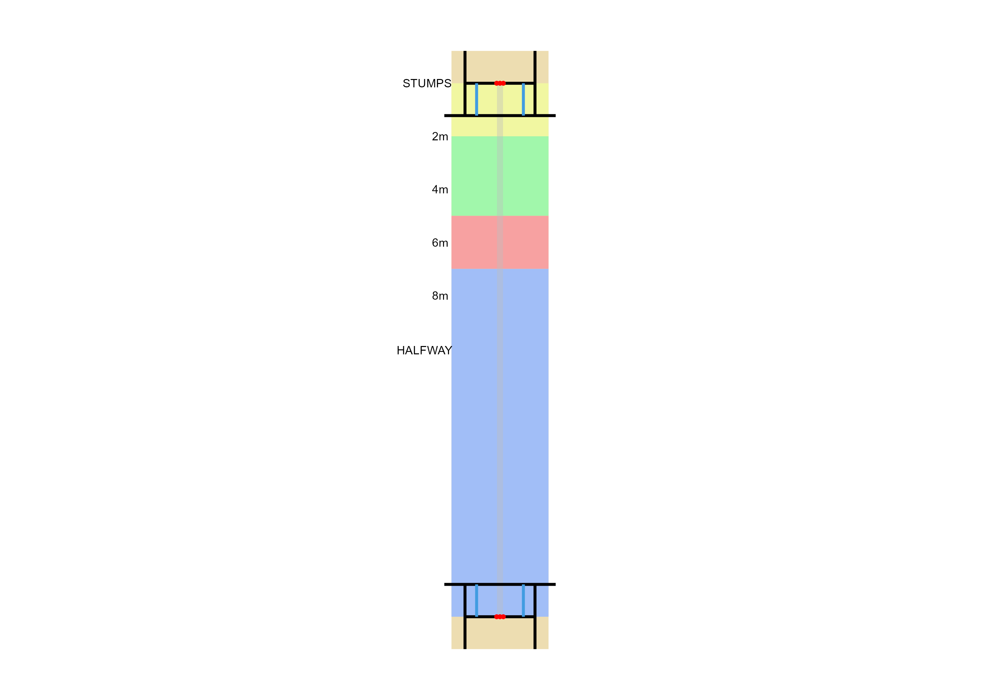

# CricketPlotFunctions
This repository contains a set of functions to plot a cricket field and a cricket pitch

## Contents
- `cricket_plot_functions.R`: R script containing functions to plot a cricket field and a cricket pitch
- `CricketPlotFunctions.Rproj`: R project file for the CricketPlotFunctions project.
- `README.md`: This file providing an overview of the repository.
- `images`: Folder containing images of the plots that the functions generate

## Example Plots
`cricket_field(straight_boundary = 60, square_boundary = 70)` 

`cricket_pitch()`

`cricket_pitch_annotated()`

